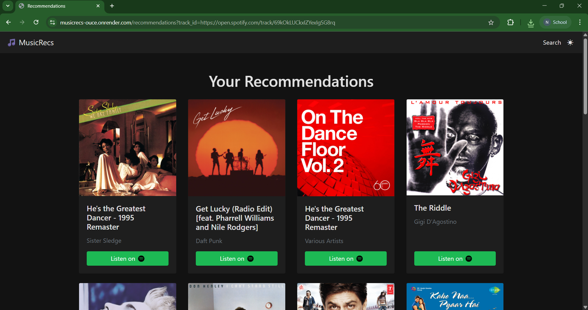

# MusicRecs

MusicRecs is a Flask-based web service that recommends songs similar to any track you like, leveraging the Spotify API under the hood. You can try it live at [MusicRecs](https://musicrecs.onrender.com/).

> **Note:** On Render’s free tier the service may take **up to 60 seconds** to cold-start after each deploy or period of inactivity.

---

## Table of Contents

1. [Features](#features)  
2. [Demo](#demo)  
3. [Getting Started](#getting-started)  
   - [Prerequisites](#prerequisites)  
   - [Installation](#installation)  
   - [Configuration](#configuration)  
4. [Usage](#usage)  
5. [Deployment](#deployment)  
6. [Environment Variables](#environment-variables)
7. [License](#license)  

---

## Features

- **Search** any track by name or by artist  
- **Recommend** a list of similar songs using precomputed embeddings  
- **OAuth** login via Spotify for personalized features  
- **Lightweight**: single-file Flask application + precomputed model  

---

## Demo

  
*Search for “Daft Punk” and get back similar tracks!*

Live version: [MusicRecs](https://musicrecs.onrender.com/)

---

## Getting Started

### Prerequisites

- Python 3.8+  
- A Spotify Developer account (to obtain client ID/secret)  

### Installation

1. **Clone this repository**  
   ```bash
   git clone https://github.com/nikhil-405/MusicRecs.git
   cd MusicRecs
   ```
2. **Download the precomputed recommender model from the releases within this repository**  
   ```bash
   curl -L https://github.com/nikhil-405/MusicRecs/releases/download/v1.0/recommender.pkl -o recommender.pkl
   ```

3. **Install dependencies**  
   ```bash
   pip install -r requirements.txt
   ```

### Configuration

Create a `.env` file in the project root (and add it to `.gitignore`). Add the following variables:

```ini
SPOTIPY_CLIENT_ID=
SPOTIPY_CLIENT_SECRET=
FLASK_SECRET_KEY=random_secret_key
```

---

## Usage

To run locally:

```bash
python3 app.py
```

Then visit `http://localhost:5000` in your browser.

---

## Deployment on Render

**Build command** [in service provider dashboard (Render in my case)]:

```bash
curl -L https://github.com/nikhil-405/MusicRecs/releases/download/v1.0/recommender.pkl   -o recommender.pkl && pip install -r requirements.txt
```

**Start command**:

```bash
gunicorn app:app --workers 3 --bind 0.0.0.0:$PORT
```

---

## Environment Variables

| Name                    | Description                                                    |
| ----------------------- | -------------------------------------------------------------- |
| `SPOTIPY_CLIENT_ID`     | Spotify OAuth client ID                                        |
| `SPOTIPY_CLIENT_SECRET` | Spotify OAuth client secret                                    |
| `FLASK_SECRET_KEY`      | Secret key for Flask session cookies                           |

---

## License
This project is licensed under the MIT License. See the [LICENSE](LICENSE) file for details.